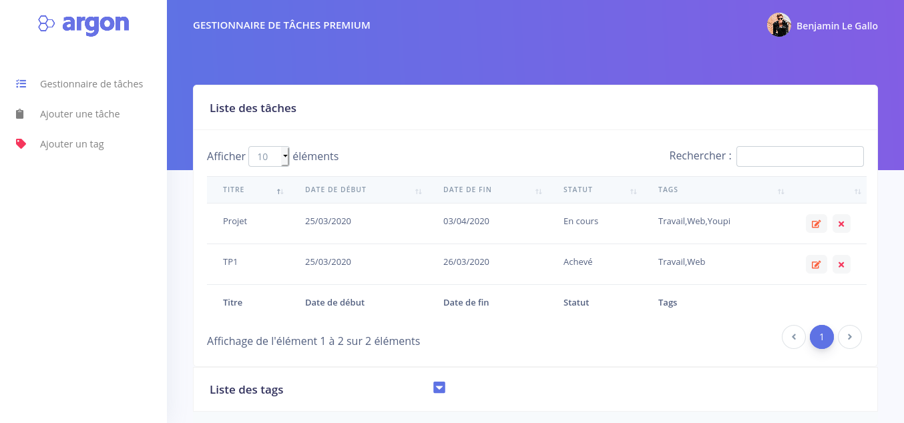

# APP-Todo
   

Task management app - NodeJS

## Installation

1. You need `Node.js` **(at least 12.x version)** installed on your machine, if you don't have it, you should install it - download [link](https://nodejs.org/en/download/)

2. [Clone the project **recursively** from github](https://github.com/jiben22/APP-Todo) or [download the archive](https://github.com/jiben22/APP-Todo)

   `git clone https://github.com/jiben22/APP-Todo --recursive`

3. `cd` to your downloaded Task management app

4. Install necessary dependencies:

   - **Via node `npm` package manager** - Run `npm install` on the project root

## How to run

`npm run start`

Go to [http://localhost:8000](http://localhost:8000)

## Licensing

- Copyright 2019 Creative Tim (https://www.creative-tim.com/?ref=adn-readme)
- Licensed under MIT (https://github.com/jiben22/APP-Todo/blob/master/LICENSE.md)

## Credits

- [Creative Tim](https://creative-tim.com/?ref=adn-readme)
- [Under Development Office](https://udevoffice.com/ref=creativetim)